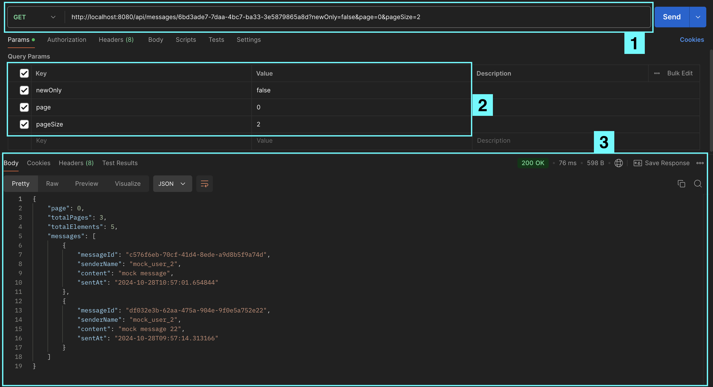

# Messaging Service API

1. [Project Description](#project-description)
   1. [BASE URL](#base-url)
2. [Endpoints](#endpoints)
    1. [GET](#1-get)
    2. [POST](#2-post)
    3. [DELETE](#3-delete)
3. [Installation](#installation)
4. [Running and Testing](#running-and-testing)

## Project Description

This project is a Java-based RESTful API that uses Maven to handle dependencies. It handles messages from/to users. 
### BASE URL

```
http://localhost:8080/api/messages
```

## Endpoints

The project has GET, POST and DELETE endpoints, each handling request that have to do with messages.

- UNIQUE IDENTIFIER: Users and messages are identified with ID for two reasons - 1) I
  assume that the client would already have the ID, and 2) it's safer to identify entities (users) with their unique
  identifiers (ID) because, depending on the client, the email or user_name could be changed.
- HEADER: the _Content-Type_ should be _application/json_

### 1. GET
path:
```
/{userId}
```

- USE: retrieve _new_ and _all_ messages for a user.
- FEATURES: The endpoint is built with pagination in mind, so along with a list of messages, it will also show the
  current page, total number of pages, and total number of elements (messages).
- REQUEST ELEMENTS: There are four variables that can be added to the path of this endpoint.
    1. "userId" (UUID) as a path variable - __required__
    2. "newOnly" (boolean) - __not required__.
        1. The default value is _true_, so if no value is provided from
           the client side the endpoint will serve only new messages.
        2. To get all messages, _false_ value should be provided
    ```
    /{userId}?newOnly=false
    ```
    3. "page" (int) - __not required__. The default value is 0 (first page).
    4. "pageSize" (int) - __not required__. The default value is 10 (it will show 10 messages at a time, unless
       requested
       otherwise).

Including all the variables for this endpoint, the path would look like this:

```
/{userId}?newOnly=false&page=0&pageSize=2
```

The response would look like this:

```
{
    "page": 0,
    "totalPages": 3,
    "totalElements": 5,
    "messages": [
        {
            "messageId": "df032e3b-62aa-475a-904e-9f0e5a752e22",
            "senderName": "mock_user_2",
            "content": "mock message 22",
            "sentAt": "2024-10-28T09:57:14.313166"
        },
        {
            "messageId": "b5df45e3-b5ea-4dbd-879a-e5d5b6af1acd",
            "senderName": "mock_user_2",
            "content": "mock message",
            "sentAt": "2024-10-28T09:17:15.372784"
        }
    ]
}
```

### 2. POST
path:
```
/new
```

- USE: create a new message
- REQUEST ELEMENTS: This endpoint requires a request body with three elements:

```
{
    "senderId": "2f3197d6-f0d9-480a-9784-2588012e3e73",
    "receiverId": "6bd3ade7-7daa-4bc7-ba33-3e5879865a8d",
    "content": "mock message"
}
```

The response would look like this:

```
{
    "messageId": "df032e3b-62aa-475a-904e-9f0e5a752e22",
    "content": "mock message",
    "senderId": "2f3197d6-f0d9-480a-9784-2588012e3e73",
    "receiverId": "6bd3ade7-7daa-4bc7-ba33-3e5879865a8d",
    "sentAt": "2024-10-28T09:57:14.313166"
}
```

### 3. DELETE
path:
```
/remove?messageId={messageId}
```

- USE: Delete _one_ or _multiple_ message  
  To delete two messages call the endpoint like this ↓ Same logic applies for multiple message IDs.
    ```
    /remove?messageId={messageId}&messageId={messageId}
    ```
- FEATURES: The endpoint is anticipating the message ids in a form of a list, so the list size can go for from 1 
(deleting one message) up to as many message ids are provided by the client.

## Installation

To build and run the project you could proceed in two ways - through the terminal or through an IDE such as IntelliJ.

### Through the terminal

1. Navigate to the project folder

```
cd osttra-home-assignment-oct2024
```

2. Then download the dependencies and build the project by running:

```
mvn clean install
```

3. Run the docker container for the database

```
docker compose up -d
```

4. Navigate to the target folder and execute the jar file

```
cd target/ && java -jar messaging-service-0.0.1-SNAPSHOT.jar
```

The app should be ready and running on port 8080.

### Through IntelliJ

1. Open the project in the IDE (IntelliJ)
2. From the terminal run the docker container for the database

```
docker compose up -d
```

3. In the project folders find the main class file _MessagingServiceApplication.java_,
   right-click on it and select _Run_.

   The app should be ready and running on port 8080.

## Running and Testing
When initially run, the database will have prepopulated data for users and messages.  
There are two prepopulated user with IDs: 6bd3ade7-7daa-4bc7-ba33-3e5879865a8d and 2f3197d6-f0d9-480a-9784-2588012e3e73.

There are a couple of ways you can test this API:
### 1. Using curl in the terminal
```
curl http://localhost:8080/api/messages{path}
```
examples:  

GET:
```
curl http://localhost:8080/api/messages/6bd3ade7-7daa-4bc7-ba33-3e5879865a8d?newOnly=false
```
POST:
```
curl -X POST http://localhost:8080/api/messages/new \
     -H "Content-Type: application/json" \
     -d '{"senderId": "2f3197d6-f0d9-480a-9784-2588012e3e73","receiverId": "6bd3ade7-7daa-4bc7-ba33-3e5879865a8d","content": "mock message"}'
```
DELETE:
```
curl -X DELETE http://localhost:8080/api/messages/remove?messageId=2bd3ade7-7daa-4bc7-ba33-3e5879865a53
```
### 3. Through Postman
You can use the browser version, but you need to sign up.
1. Paste the [BASE URL](#base-url) + the corresponding path in the input bar at the top. Make sure to choose the 
right method and extension [GET](#1-get)/[POST](#2-post)/[DELETE](#3-delete) at the left end of it. Click _Send_ to execute
2. The parameters (where applicable) will be populated here. You can change them in these input fields. 
When testing the POST endpoint enter the Request Body in the _Body_, select the _raw_ radio button, and at the end of 
that line select _JSON_. Paste or type the body here as shown in the [POST](#2-post) section.
3. At the bottom is where you get the result. The status code is on the right (The green '200 OK' in the screenshot)  

   
